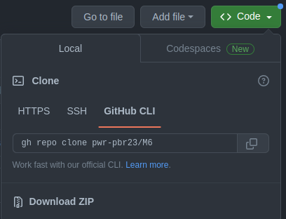
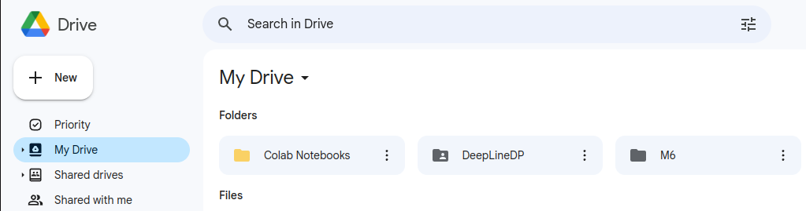
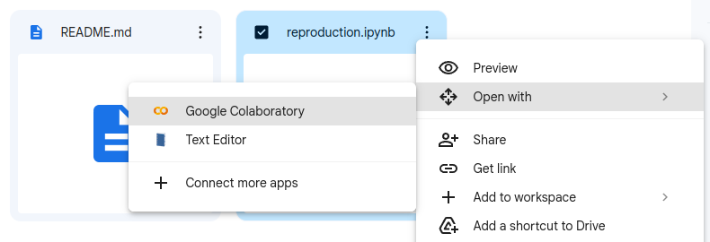
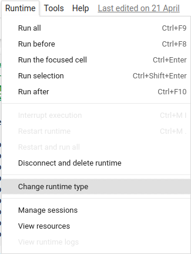
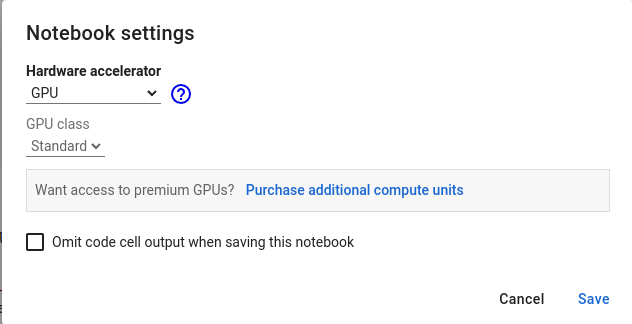

# Topic: DeepLineDP: Towards a Deep Learning Approach for Line-Level Defect Prediction

## Approach towards extending the original repository
Original repository for research paper was separated into two:
- supplementary materials (scripts for training models) - 
the original from [awsm-research/DeepLineDP](https://github.com/awsm-research/DeepLineDP) 
was pasted into [DeepLineDP](/DeepLineDP) folder.
- database - original from [awsm-research/line-level-defect-prediction](https://github.com/awsm-research/line-level-defect-prediction)
was pasted into [DeepLineDP/datasets](/DeepLineDP/datasets) folder.

We decided to merge two repositories in order to make reproduction easier.

## Preparation for reproduction
Since models require CUDA to be able to run and not all computers can have it installed we decided to do a reproduction on google colab.
For this reason there are a couple of steps required to do before reproduction itself.

1. Download this repository using _Download ZIP_ option.

2. Upload folder to drive to the main catalog (for this example the folder is called _M6_).

3. Go to uploaded folder and find [reproduction.ipynb](/reproduction.ipynb) script. 
Choose _Open with > Google Colaboratory_ option.

4. Change runtime type to GPU _Change runtime type -> GPU -> Save_.

## Running reproduction script
...

## Suplementar articles
- LineVD: Statement-level Vulnerability Detection using Graph Neural Networks
  - Artykuł: https://arxiv.org/pdf/2203.05181.pdf
  - GitHub: https://github.com/davidhin/linevd
- VULGEN: Realistic Vulnerability Generation Via Pattern Mining and Deep Learning
  - Artykuł: https://software-lab.org/publications/icse2023_VulGen.pdf
  - GitHub: brak
  - Zenodo: https://zenodo.org/record/7569854#.ZCXXYXZBxPY

## Project links
- Overleaf: https://www.overleaf.com/project/6401cb6ce8e0e36a2d64e237
- Trello: https://trello.com/b/rlZQmIfa/pbr-zadania
- Google Colab: https://colab.research.google.com/drive/1N2QC_qhmjsM_PFjEKNV7z_tfkPNCpvyT?authuser=1#scrollTo=wYT-CKR476kG

## Authors
- Kamila Sproska
- Dominik Polak
